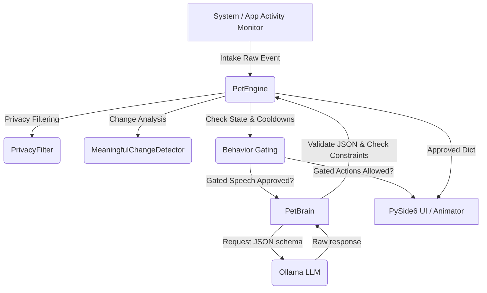

# Squish-Mate Architecture Refactor Walkthrough

The Squish-Mate desktop pet application has been refactored from an LLM-reactive loop to a robust, deterministic, **Engine-Authoritative** model. The LLM is now relegated to a creative accessory that acts under strict constraints and structured outputs, ensuring Pip acts like a living companion with metabolic rhythms.

---

## 1. Architectural Blueprint



---

## 2. Refactored Modules & Enhancements

### A. Authoritative PetEngine (`pet_engine.py`)
- **Metabolism & Needs**: Tracks `energy`, `sleepiness`, `socialEnergy`, `boredom`, `curiosity`, and `engagement`. Passive drain operates during active ticks, while recovery triggers during sleep.
- **Sleep Simulation**: Pip naturally falls asleep when exhausted and wakefully recovers. Offline elapsed time is calculated during start-up to simulate active sleep/drain while the application was closed.
- **Meaningful-Change Detection**: Noise (such as tiny app window changes) is filtered out using similarity scores, preventing duplicate LLM requests.
- **Privacy Filtering**: Redacts credentials, tokens, IP addresses, emails, and sensitive inputs before any event processing.
- **Behavior Gating**: Implements topic cooldowns, global speech spacing, and typing suppression to make interactions feel natural and non-intrusive.
- **LLM Schema Validation**: Validates JSON formats, word count bounds, anatomy constraints (no fur/legs/paws), and bans surveillance language.

### B. Compatibility Wrapper Memory (`pet_memory.py`)
- Rewritten to delegate all reads, notes, facts, and compaction routines directly to the thread-safe `PetEngine` state. This prevents concurrent write corruption and removes the overhead of manually parsing and rewriting a local markdown file.

### C. Gemma-Optimized JSON Brain (`pet_brain.py`)
- Employs a structured JSON system prompt forcing Ollama to return a schema:
  ```json
  {
    "text": "Goofy text under 14 words",
    "suggestedEmotion": "neutral/happy/curious/etc.",
    "suggestedAction": "wobble/hop/wave/etc."
  }
  ```
- Integrates validation with `PetEngine.validate_llm_response` to reject non-compliant raw output and automatically fall back to safe local lines.

### D. GUI Integration (`desktop_pet.py` & `pet_window.py`)
- Scheduled a 2-second periodic tick timer on the PySide6 loop to feed metabolic updates to the engine.
- Configured the animator to execute physical actions and trigger sleep/wake visual state machines based on engine suggestions.
- Modified speech bubbles to accept structured objects containing custom emotions and actions.

---

## 3. Verifying the System

### Unit Tests
The unit test suite covers privacy scrubbing, speech gating, typing suppression, metabolic decay, sleep states, offline restoration, deduplication, LLM constraint validations, and state-corruption recovery:
```bash
.venv/bin/python test_pet_engine.py
```

### Integration Tests
The integration suite tests end-to-end delegation from `PetMemory` and `PetBrain` to the `PetEngine` using mocked Ollama JSON responses and fallbacks:
```bash
.venv/bin/python test_integration.py
```
